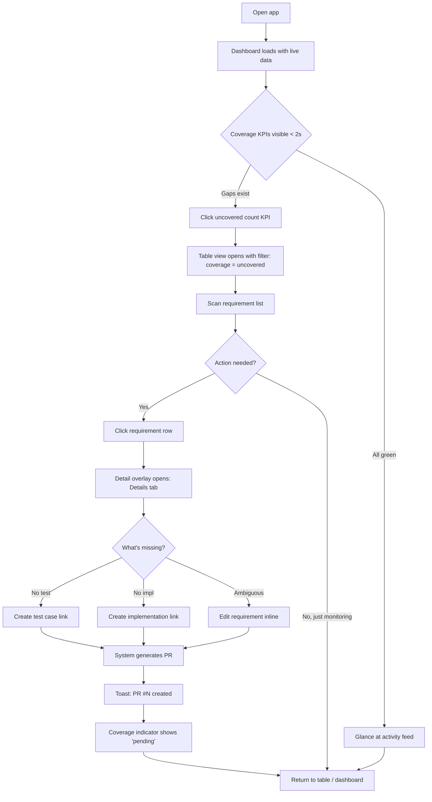
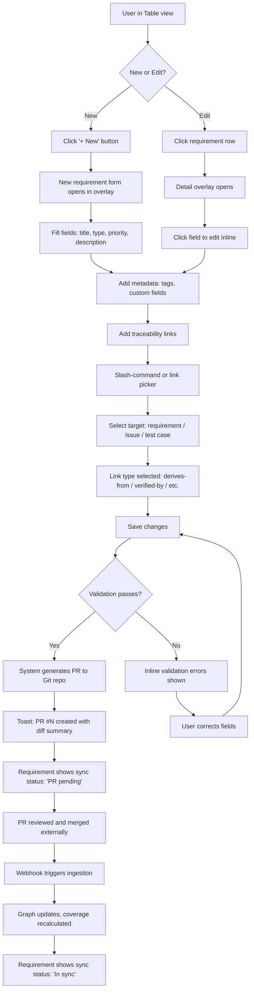
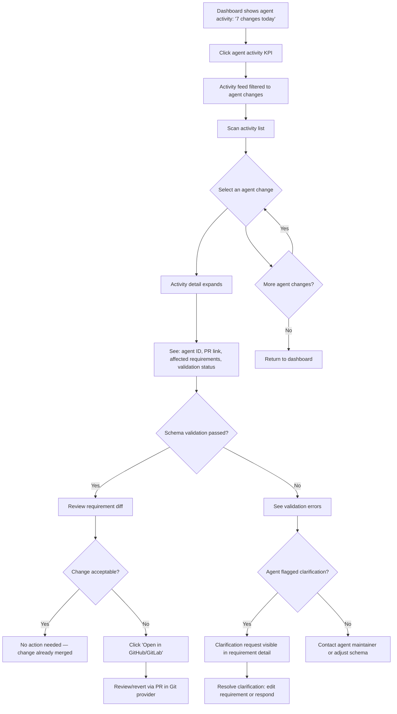
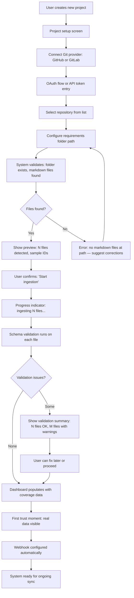
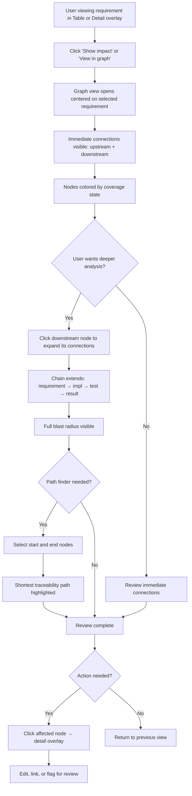

# UX Design Specification Requirements-management

**Author:** Andreisadakov
**Date:** 2026-03-09

---

## Executive Summary

### Project Vision

A Requirements Management & Traceability (RMT) web application that indexes requirements stored as markdown files in a Git repository, builds an internal traceability graph, and provides coverage analysis, compliance reporting, and audit-ready documentation. The Git repository is the single source of truth — UI-originated changes flow back to Git via system-generated pull requests. The platform is purpose-built for AI-driven software development lifecycles, with AI agents operating directly on requirement files in Git. No existing RTM solution serves this space.

### Target Users

**Product Owner** — Owns the product roadmap and requirement priorities. Needs at-a-glance coverage visibility, impact analysis for scope changes, and the ability to author/edit requirements through the web UI with changes flowing to Git as PRs.

**Business Analyst** — Authors and structures detailed requirements. Needs hierarchical organization, rich metadata, custom fields, and traceability links. Cares about completeness: are all requirements linked, tested, and covered?

**AI SDLC Manager** — Establishes and manages AI-agent-driven development workflows. Needs to monitor agent activity on requirements, review agent-authored changes, resolve agent clarification requests, and ensure schema compliance across the repository. This is a new role with no established UX conventions.

All three personas are technically comfortable with Git concepts (branches, PRs, commits). Desktop web is the only access interface.

### Key Design Challenges

1. **Traceability graph at scale** — Visualizing interconnected requirements, issues, test cases, and test results as an interactive graph that remains readable and useful for finding coverage gaps, orphans, and broken links at hundreds-to-thousands of nodes.

2. **Git-native UI parity** — The UI must feel like a first-class authoring environment while faithfully reflecting Git state. Ingestion status, conflicts, and PR-based write-back must be seamless, not bureaucratic.

3. **AI agent transparency** — No established UX pattern exists for surfacing AI agent activity on requirements. The system must make agent-authored changes, clarification requests, and validation results visible and trustworthy without creating noise.

4. **Progressive compliance disclosure** — Baselines, audit trails, change rationale, and regulatory exports must be powerful when activated and invisible when not configured.

### Design Opportunities

1. **Category-defining UX** — As the first RTM solution for AI SDLC, the coverage dashboard and traceability graph can define the category experience rather than follow existing conventions.

2. **Coverage dashboard as command center** — The primary landing experience: coverage indicators, orphan counts, agent activity feed, ingestion health — all at a glance with drill-down into the traceability graph.

3. **Git-native confidence** — Sync status, commit SHAs, PR links, and conflict states shown directly in requirement views to build trust in system accuracy with technically comfortable users.

## Core User Experience

### Defining Experience

The core user experience centers on **coverage status checking** — the most frequent user action and the product's primary value surface. Users open the application to answer one question: "Are my requirements covered?" The coverage dashboard is the answer, and it must be accurate, immediate, and actionable.

This experience is only possible because **automatic Git synchronization** operates as invisible infrastructure. The traceability graph stays fresh without user intervention. Requirements merged via PRs — whether authored by humans or AI agents — appear in the coverage view within seconds. Users never think about sync; they trust the dashboard because it is always current.

### Platform Strategy

- **Desktop web application only** (no mobile, no native desktop packaging)
- **Mouse/keyboard-optimized** interactions with keyboard shortcuts for power users
- **No offline requirement** — the system depends on live Git connectivity and webhook ingestion
- **GitHub and GitLab** are the only repository integrations for v1 (no Jira, Linear, or Slack)

### Effortless Interactions

- **Coverage status** is visible the moment the application loads — no navigation required
- **Git synchronization** happens automatically on every merged PR/MR via webhooks — no manual trigger
- **Orphan detection** surfaces uncovered requirements without the user asking
- **Impact analysis** shows the blast radius of a requirement change in-context, not in a separate report
- **Agent activity** appears inline with requirement changes — no separate "agent dashboard" needed

### Critical Success Moments

1. **First trust**: User connects a repository, requirements are ingested, and the coverage dashboard populates with real data within seconds. No manual import, no configuration wizard.
2. **Gap discovery**: User sees a red indicator, clicks it, and immediately understands which requirement is uncovered, why, and what to do about it.
3. **Silent sync**: An AI agent merges a PR modifying requirements. The dashboard updates without user action. The change is traceable to the agent's commit.
4. **Trust failure (make-or-break)**: If the dashboard ever shows stale or incorrect data because sync failed silently, user trust is permanently damaged. Ingestion failures must be loud and visible.

### Experience Principles

1. **Coverage is the heartbeat** — The coverage dashboard is the primary interface. Every design decision optimizes for "how fast can I understand my coverage status?"
2. **Sync is invisible infrastructure** — Git synchronization is automatic, reliable, and silent. The default state is "it just works." Failures are surfaced clearly.
3. **Gaps scream, health whispers** — Problems are impossible to miss. A healthy system feels calm, not noisy with confirmations.
4. **One click from overview to detail** — Any dashboard indicator is one click from the specific requirement, link, or commit that explains it.
5. **Trust through transparency** — Sync timestamps, commit SHAs, ingestion status, and PR links are visible. Users trust what they can verify.

## Desired Emotional Response

### Primary Emotional Goals

**Confident and in control** — The dominant feeling when using Requirements-management. Users should feel they have complete command over every requirement across the entire SDLC. Not overwhelmed by data, not anxious about gaps — genuinely in control because the system gives them full visibility.

**"I can truly control all requirements in the whole SDLC"** — This is the statement that makes users recommend the product to colleagues. It's not about speed or cost savings alone — it's the feeling of total situational awareness across requirements, implementation, testing, and AI agent activity.

### Emotional Journey Mapping

| Stage | Desired Feeling | Design Implication |
|-------|----------------|-------------------|
| First discovery | Curiosity + clarity | Clean landing page that immediately communicates "traceability for AI SDLC" — no enterprise jargon |
| Onboarding / repo connect | Confidence building | Fast time-to-value: repo connected → requirements indexed → dashboard populated in under a minute |
| Daily use (coverage check) | Calm control | Dashboard loads instantly, coverage state is unambiguous, no interpretation needed |
| Gap discovery | Informed alertness | Red indicators are clear but not alarming — the system caught it, user just needs to act |
| Sync conflict / failure | Calm confidence | The system detected the problem, preserved both versions, and presents a clear resolution path. No panic. |
| Reviewing AI agent changes | Trust + oversight | Agent activity is visible and attributable — the user feels like a manager reviewing work, not a detective hunting for changes |
| Returning after time away | Reassurance | The dashboard reflects the current truth. Nothing drifted. Sync kept working while they were gone. |

### Micro-Emotions

**Critical to cultivate:**
- **Confidence** over confusion — every screen answers "what am I looking at?" within 2 seconds
- **Trust** over skepticism — sync timestamps, commit SHAs, and ingestion status are always visible
- **Accomplishment** over frustration — completing a traceability review feels like closing a loop, not fighting a tool

**Critical to avoid:**
- **Anxiety** — coverage gaps should feel like actionable items, not emergencies
- **Suspicion** — users should never wonder "is this data current?" The answer must always be visible
- **Overwhelm** — large requirement sets must be navigable, filterable, and progressively disclosed

### Design Implications

- **Confidence → Clean visual hierarchy**: Coverage status uses bold, unambiguous color coding (green/amber/red) with numeric indicators. No decorative noise.
- **Control → Direct manipulation**: Users interact with requirements and links directly — click to drill down, click to edit, click to trace. No modal wizards or multi-step workflows for common actions.
- **Calm confidence in errors → Non-alarming error patterns**: Conflicts and failures use amber/yellow with clear action labels ("Resolve conflict", "Retry ingestion"), not red emergency banners.
- **Trust → Provenance always visible**: Every requirement shows its sync state, last commit, and source. Every change shows its actor (human or agent) and timestamp.
- **Oversight of AI agents → Attributed activity feed**: Agent changes are shown with the same visual weight as human changes, but with a clear agent indicator. No separate "AI section" — agents are participants, not a special case.

### Emotional Design Principles

1. **Control, not surveillance** — The UI empowers users to manage requirements, not monitor a system. The user is the decision-maker; the system is the instrument.
2. **Calm authority** — The visual language should feel like a well-organized command center: structured, clear, and composed. Not playful, not corporate-sterile.
3. **Errors are handled, not feared** — When something goes wrong, the design communicates "we caught this, here's what to do" rather than "something broke."
4. **AI is a team member, not a black box** — Agent activity is shown transparently alongside human activity, building trust through visibility rather than hiding complexity.

## UX Pattern Analysis & Inspiration

### Inspiring Products Analysis

No existing RTM solution serves the AI SDLC space. Inspiration is drawn from adjacent-domain products with proven UX patterns relevant to the product's core experiences:

**Grafana / Datadog** (monitoring dashboards) — Best-in-class dashboard-as-home-screen pattern. Health indicators at a glance, color-coded severity, drill-down from overview to specific metric. Model for the coverage dashboard.

**GitHub** (repository + PR workflows) — Activity feeds, PR status checks, diff views, commit attribution. Model for Git-native change visibility, agent activity surfacing, and schema validation feedback.

**Linear** (project management) — Keyboard-first, minimal chrome, fast transitions, contextual actions. Model for interaction quality and the "calm authority" emotional goal.

**Neo4j Browser / Bloom** (graph visualization) — Interactive node-and-edge exploration, progressive expansion, path highlighting, type-based filtering. Model for the traceability graph.

**Notion** (structured content) — Inline editing, multiple views (tree/table/board), slash-commands, hierarchical sidebar. Model for requirement authoring and organization.

### Transferable UX Patterns

**Navigation:** Repository-scoped hierarchy (project → module → requirement) with a collapsible sidebar tree and Cmd+K command palette for keyboard-first access.

**Dashboard:** Home screen with coverage %, orphan counts, sync health, and recent activity. Color-coded indicators (green/amber/red). Click any metric to drill into the underlying data without page transition.

**Activity feed:** Chronological stream of changes with actor attribution (human or agent), commit links, and contextual actions. Aggregated for agent activity to prevent noise.

**Graph visualization:** Interactive canvas with zoom, pan, and focus. Click a node to expand connections. Filter by node type and link type. Path highlighting for traceability chain traversal. Opens focused on a single requirement, expands on demand.

**Authoring:** Inline editing (click to edit, no modal edit mode). Multiple views of the same requirement set (tree, table). Slash-commands for structured actions (add link, insert template).

**Interaction quality:** Keyboard shortcuts for all frequent actions. Minimal chrome. Fast transitions with no loading spinners for in-memory operations. Contextual actions on hover/selection, not permanent toolbars.

### Anti-Patterns to Avoid

- **Deep menu hierarchies and modal-first design** (DOORS pattern) — Every action behind a dialog kills flow. Use inline editing and contextual actions instead.
- **Flat, disconnected data** (spreadsheet pattern) — No live links, no interactivity. The traceability graph must be interactive and navigable, not a static table.
- **Dashboard overload** (Grafana pitfall) — Too many panels with no hierarchy. The coverage dashboard needs a clear primary indicator with supporting details, not a wall of charts.
- **Notification spam** (GitHub pitfall) — Agent activity must be aggregated and contextual. One summary per PR, not one alert per file changed.
- **Graph hairball** (Neo4j pitfall) — Showing all nodes at once is unreadable. The graph opens focused on a selected requirement and expands on demand.

### Design Inspiration Strategy

**Adopt directly:**
- Grafana-style dashboard-as-home-screen with coverage KPIs and drill-down
- GitHub-style activity feed with actor attribution for human and agent changes
- Linear-style keyboard-first interaction model and minimal visual chrome
- Notion-style inline editing for requirement fields

**Adapt for this domain:**
- Neo4j graph exploration adapted with requirement-specific node types, coverage coloring, and orphan highlighting
- GitHub diff view adapted for requirement field changes (not code lines)
- Grafana time-range selector adapted for baseline comparison (not time series)

**Avoid:**
- DOORS-style modal complexity and mandatory configuration
- Spreadsheet-style flat traceability without live links
- Unfiltered graph rendering that creates visual noise
- Per-event notification patterns for high-frequency agent activity

## Design System Foundation

### Design System Choice

**Shadcn/ui + Tailwind CSS** with Radix UI primitives as the component foundation.

Graph visualization will use a dedicated library (D3.js or vis.js) integrated into the component system. Charts and dashboard panels will use Recharts or a similar React-native charting library styled with Tailwind tokens for visual consistency.

### Rationale for Selection

- **Visual uniqueness for a category-defining product** — Shadcn/ui components are copy-paste code you own, not a locked library. This allows full control over the "calm authority" aesthetic without fighting a pre-existing design language (Material, Ant).
- **Keyboard-first accessibility** — Built on Radix UI primitives, which provide best-in-class keyboard navigation, focus management, and ARIA compliance out of the box. Supports the Linear-inspired interaction model.
- **Tailwind utility-first styling** — Enables rapid visual iteration, consistent spacing/color systems via design tokens, and responsive layouts without CSS overhead. Design tokens defined once propagate across all components.
- **Composable architecture** — Components are small, composable, and independent. Custom components (traceability graph, coverage dashboard panels, requirement editor) integrate seamlessly because they share the same Tailwind token system.
- **Ecosystem alignment** — Linear, Vercel, and other modern developer tools use this stack. The aesthetic sensibility aligns with the target user base (technically comfortable, Git-fluent professionals).

### Implementation Approach

**Core component layer:**
- Shadcn/ui for all standard UI elements: buttons, inputs, dialogs, dropdowns, tooltips, tabs, tables, command palette (Cmd+K), sidebar navigation, toast notifications
- Radix UI primitives for accessible interactive patterns: popovers, accordions, context menus, hover cards

**Specialized component layer:**
- **Traceability graph**: D3.js or vis.js with custom React wrapper, styled with Tailwind tokens for node colors, edge styles, and overlays
- **Coverage dashboard panels**: Recharts for coverage %, bar charts, and trend indicators, wrapped in Shadcn card components
- **Requirement editor**: Custom inline-edit component built on Radix primitives with Tailwind styling
- **Diff view**: Custom requirement-field diff component (not code-line diff), styled consistently with the design system

**Design token strategy:**
- Color palette, spacing scale, typography, and border radius defined as Tailwind CSS variables
- Semantic tokens for coverage states: `--color-covered` (green), `--color-partial` (amber), `--color-uncovered` (red), `--color-conflict` (yellow)
- Actor tokens: `--color-human-actor`, `--color-agent-actor` for activity feed attribution

### Customization Strategy

- **Theme**: Dark and light mode support via Tailwind CSS variables (dark mode is expected by developer-tool users)
- **Density**: Default to a high-density layout (more data visible per viewport) with an option for comfortable spacing
- **Coverage color system**: Consistent green/amber/red semantic colors used across dashboard, graph nodes, table row indicators, and sidebar badges
- **Typography**: System font stack for body text (fast loading, native feel). Monospace for requirement IDs, commit SHAs, and technical metadata.
- **Motion**: Minimal, purposeful animations — graph transitions, panel expand/collapse, toast entry/exit. No decorative motion.

## Defining Experience

### Core Interaction

**"See your entire requirement landscape over AI SDLC and know instantly what's covered, what's broken, and what needs attention."**

This is the interaction users will describe to colleagues. It combines three elements no existing tool provides together: full requirement visibility, real-time coverage status, and AI agent activity transparency — all within the context of an AI-driven software development lifecycle.

### User Mental Model

Users bring a **control room** mental model: they expect to open the application and immediately see the state of their project, the way an operations engineer sees a monitoring dashboard. They do not expect to "search for" their data or "navigate to" their requirements — the most important information should be on screen at launch.

Current approaches (spreadsheet cross-referencing, manual document audits, ad-hoc queries) feel terrible because they are slow, incomplete, and untrustworthy. Users cannot answer "is this requirement covered?" without manual investigation. This product eliminates that investigation entirely.

The mental model shift: from "I need to go find out" to "I already know."

### Success Criteria

- Coverage dashboard loads with real data in < 2 seconds — no skeleton screens for the primary indicator
- User identifies the most critical gap within 5 seconds of looking at the dashboard
- Drill-down from dashboard indicator to specific requirement takes exactly one click
- Traceability chain for any requirement is visible without navigating away from the requirement view
- User can take corrective action (create link, assign, edit) without leaving the requirement context
- AI agent changes are attributable within the same visual flow as human changes — no context switch

### Novel UX Patterns

**Established patterns (adopt directly):**
- Dashboard-as-home-screen with KPI panels and drill-down (Grafana/Datadog)
- Hierarchical sidebar navigation with collapse/expand (Notion/GitHub)
- Command palette for keyboard-first navigation (Linear/VS Code)
- Inline editing for requirement fields (Notion)

**Combined patterns (adapt for this domain):**
- Traceability chain visualization: tree/graph hybrid adapted from Neo4j with coverage-state coloring on nodes and SDLC-specific node types (requirement → implementation → test → result)
- Requirement diff view: GitHub-style diff adapted for structured field changes rather than code lines

**Novel patterns (define for this product):**
- **AI agent attribution in activity feeds**: Agent-authored changes displayed alongside human changes with a distinct but non-separate visual indicator. No "AI tab" — agents are participants in the same timeline.
- **Coverage-state propagation**: When a requirement's coverage changes (test added, link broken), the change propagates visually up to parent modules and dashboard indicators in real-time without page refresh.
- **Ingestion confidence indicator**: A persistent, subtle status element showing sync health — last sync time, pending changes count, conflict count. Visible but non-intrusive when healthy; prominent when degraded.

### Experience Mechanics

**1. Initiation — User opens the app:**
- Coverage dashboard is the home screen — no navigation required
- Primary indicator: overall coverage % (large, prominent, green/amber/red)
- Supporting indicators: orphan count, sync health, recent changes, agent activity summary
- Time context: "as of [last sync timestamp]" always visible in the header

**2. Investigation — User spots a gap and drills in:**
- Click any coverage indicator → filtered requirement list showing only affected items
- Click any requirement → split view: requirement details (left), traceability chain (right)
- Traceability chain shows: upstream source → requirement → implementation items → test cases → test results
- Each node shows its status (covered/uncovered/failing) and actor (human/agent)
- One click from any requirement to open the traceability graph centered on that node

**3. Feedback — System confirms the user is on track:**
- Coverage indicators update in real-time as changes sync (no manual refresh)
- Breadcrumb trail: Dashboard → Module → Requirement → Traceability
- Keyboard shortcut hints appear contextually (Esc to go back, arrows to navigate siblings)

**4. Resolution — User takes action:**
- Create a test case link, assign implementation, or edit the requirement — all inline, no modal
- UI-originated changes generate a PR: toast notification "PR #42 created — changes sync when merged"
- Coverage indicator transitions to "pending" state until PR merges and ingestion completes
- User returns to dashboard and sees the gap resolved (or pending resolution)

## Visual Design Foundation

### Color System

**Base palette — Slate neutrals:**

| Token | Light Mode | Dark Mode | Usage |
|-------|-----------|-----------|-------|
| `--surface-primary` | white | slate-950 | Main content background |
| `--surface-secondary` | slate-50 | slate-900 | Sidebar, panel backgrounds |
| `--surface-tertiary` | slate-100 | slate-800 | Cards, elevated surfaces |
| `--border-default` | slate-200 | slate-700 | Borders, dividers |
| `--text-primary` | slate-900 | slate-100 | Headings, primary content |
| `--text-secondary` | slate-600 | slate-400 | Supporting text, labels |
| `--text-tertiary` | slate-400 | slate-500 | Placeholder, disabled text |

**Primary accent — Indigo:**

| Token | Value | Usage |
|-------|-------|-------|
| `--accent-primary` | indigo-600 | Active states, selected items, primary buttons |
| `--accent-primary-hover` | indigo-700 | Hover states |
| `--accent-primary-subtle` | indigo-50 / indigo-950 | Subtle backgrounds for selected rows, active tabs |

**Semantic coverage colors:**

| Token | Color | Usage |
|-------|-------|-------|
| `--status-covered` | emerald-500 | Covered requirements, passing tests, healthy sync |
| `--status-partial` | amber-500 | Partially covered, pending states, in-progress |
| `--status-uncovered` | rose-500 | Uncovered requirements, failing tests, broken links |
| `--status-conflict` | yellow-500 | Ingestion conflicts, merge conflicts, action required |

**Actor attribution colors:**

| Token | Color | Usage |
|-------|-------|-------|
| `--actor-human` | (inherits text color) | No special treatment — humans are the norm |
| `--actor-agent` | teal-500 | Agent avatar ring, agent badge, agent activity indicator |

All colors meet WCAG 2.1 AA contrast ratios (4.5:1 for normal text, 3:1 for large text) in both light and dark modes.

### Typography System

**Font families:**

| Role | Font | Fallback | Usage |
|------|------|----------|-------|
| UI / Body | Inter | system-ui, sans-serif | All UI text, body content, labels, buttons |
| Monospace | JetBrains Mono | ui-monospace, monospace | Requirement IDs, commit SHAs, file paths, code |

**Type scale (compact):**

| Token | Size | Weight | Line Height | Usage |
|-------|------|--------|-------------|-------|
| `--text-xs` | 11px | 400 | 16px | Timestamps, metadata badges |
| `--text-sm` | 12px | 400 | 16px | Table cells, secondary labels |
| `--text-base` | 13px | 400 | 20px | Body text, form inputs, list items |
| `--text-md` | 14px | 500 | 20px | Emphasis text, sidebar items, table headers |
| `--text-lg` | 16px | 600 | 24px | Section headers, card titles |
| `--text-xl` | 20px | 600 | 28px | Page titles, panel headers |
| `--text-2xl` | 28px | 700 | 36px | Dashboard KPI numbers |
| `--text-mono` | 12px | 400 | 16px | Monospace content (IDs, SHAs) |

### Spacing & Layout Foundation

**Spacing scale (4px base):**

| Token | Value | Usage |
|-------|-------|-------|
| `--space-1` | 4px | Tight gaps (icon-to-label, badge padding) |
| `--space-2` | 8px | Default element gap, form field spacing |
| `--space-3` | 12px | Card padding, list item padding |
| `--space-4` | 16px | Section gaps, panel padding |
| `--space-6` | 24px | Section dividers, major content gaps |
| `--space-8` | 32px | Page-level spacing |

**Layout structure:**
- **Sidebar**: Fixed, collapsible, 240px expanded / 48px collapsed. Contains project tree, navigation, sync status.
- **Main content**: Fluid, fills remaining viewport. 12-column grid for panel arrangement.
- **Panels**: Fixed in viewport with internal scroll — no full-page scrolling on dashboard views.
- **Split view**: Requirement detail (left, ~60%) + traceability chain (right, ~40%), resizable divider.

**Density:**
- Default: high-density (tight spacing, compact type scale, more data per viewport)
- Optional: comfortable density setting increases spacing by 50% for users who prefer more breathing room

### Accessibility Considerations

- All color combinations meet WCAG 2.1 AA contrast ratios in both light and dark modes
- Coverage status never communicated by color alone — always paired with text labels or icons (checkmark, warning triangle, X circle)
- Focus indicators visible on all interactive elements (2px indigo ring)
- Keyboard navigation for all interactive components via Radix UI primitives
- Reduced motion mode respects `prefers-reduced-motion` media query
- Minimum touch/click target: 32px height for all interactive elements

## Design Direction Decision

### Design Directions Explored

Six distinct design directions were generated and evaluated:

1. **Dashboard Command Center** — KPI panels, coverage ring, activity feed, drill-down
2. **Tree-First Navigator** — Hierarchical sidebar with inline coverage badges, split detail view
3. **Graph Explorer** — Interactive traceability graph with coverage-colored nodes
4. **Split-Panel Workbench** — Collapsed sidebar, list + tabbed detail panel
5. **Table-Dense Operator** — Full-width data table with all metadata columns
6. **Kanban Coverage Board** — Requirements grouped by coverage status in columns

All directions were visualized in `ux-design-directions.html` with dark/light theme toggle and realistic data.

### Chosen Direction

**Multi-view architecture combining three directions:**

| View | Base Direction | Primary Purpose | Primary Persona |
|------|---------------|-----------------|-----------------|
| **Dashboard** | #1 Dashboard Command Center | Project health at a glance, coverage KPIs, activity feed | Product Owner, AI SDLC Manager |
| **Table** | #5 Table-Dense Operator | Browse, filter, sort, edit requirements in bulk | Business Analyst, Product Owner |
| **Graph** | #3 Graph Explorer | Traceability visualization, impact analysis, path finding | All personas, audit reviewers |

**Navigation model:**
- Dashboard is the **home screen** (loads on app open)
- Table and Graph are peer views accessible from the sidebar and via Cmd+K command palette
- Views share the same sidebar navigation, sync status indicator, and topbar structure
- Clicking a requirement in any view can open it in any other view (e.g., click a table row → jump to that node in the graph)

**Excluded directions and rationale:**
- Tree-First Navigator (#2): Tree hierarchy will be incorporated into the sidebar of all views rather than as a standalone view. Coverage badges on tree nodes carry over.
- Split-Panel Workbench (#4): The tabbed detail panel concept (Details / Traceability / History / Activity tabs) will be adopted as the requirement detail overlay accessible from both Table and Graph views.
- Kanban Coverage Board (#6): The board metaphor doesn't align with the "control room" mental model. Coverage status is a computed metric, not a workflow stage. Coverage distribution is better served by the dashboard KPIs.

### Design Rationale

1. **Dashboard as home aligns with the defining experience** — "See your entire requirement landscape over AI SDLC and know instantly what's covered, what's broken, and what needs attention." The dashboard answers this in under 2 seconds.

2. **Table as workhorse aligns with daily use** — Business Analysts and Product Owners spend most time filtering, reviewing, and editing requirements. A dense, sortable, filterable table is the most efficient interface for this. Agent attribution is visible inline without a separate view.

3. **Graph as traceability explorer aligns with the differentiator** — No existing tool provides interactive traceability graph visualization with coverage-state coloring for AI SDLC. This is the view users will demo to colleagues and auditors.

4. **Three views, one data model** — All views are projections of the same underlying traceability graph. Switching between views preserves context (selected requirement, active filters). This reinforces the "single source of truth" principle at the UI level.

### Implementation Approach

**Shared shell:**
- Collapsible sidebar (240px / 48px) with project tree, view switcher, sync status
- Topbar with breadcrumbs, search (Cmd+K), and contextual actions
- Persistent sync health indicator in sidebar footer

**Dashboard view:**
- 4-column KPI grid (coverage %, orphan count, sync health, agent activity)
- Two-column panel layout: uncovered requirements list + activity feed
- Each KPI is clickable — drills into the Table view with the corresponding filter pre-applied

**Table view:**
- Full-width data table with configurable columns (ID, title, type, priority, coverage, sync, last actor, link count)
- Column sorting, multi-field filtering, grouping (by module, type, priority, coverage status)
- Inline coverage dots and agent attribution (teal accent for agent actors)
- Row click opens requirement detail overlay (tabbed: Details / Traceability / History / Activity)
- Bulk actions: export selection, group status change

**Graph view:**
- Interactive canvas (D3.js or vis.js) with zoom, pan, and node focus
- Nodes colored by coverage state; edges represent traceability link types
- Click node to expand connections; double-click to center and focus
- Sidebar filter panel: filter by node type, link type, coverage state
- Path finder: select two nodes, highlight the shortest traceability path
- Orphan highlighting: dashed border on unlinked nodes
- Legend overlay with node type and color explanations

**Cross-view navigation:**
- From Dashboard KPI → Table with pre-applied filter (e.g., click "14 orphaned" → Table filtered to orphans)
- From Table row → Graph centered on that requirement node
- From Graph node → Requirement detail overlay (same as Table's)
- Cmd+K command palette works in all views: search requirements, switch views, jump to specific ID

## User Journey Flows

### Journey 1: Daily Coverage Check

**Persona:** Product Owner
**Goal:** Understand project health and identify gaps requiring action
**Entry point:** App opens to Dashboard view
**Frequency:** Multiple times daily



**Key UX decisions:**
- Dashboard loads with real data, not skeleton screens — coverage % is visible in < 2 seconds
- KPI click pre-applies the relevant filter in Table view (zero configuration)
- Detail overlay appears over the table, preserving list context
- Actions (create link, edit) are inline — no navigation away from context
- PR creation is a background operation with toast confirmation
- "Pending" state is visually distinct from "uncovered" — user sees progress immediately

---

### Journey 2: Requirement Authoring via UI

**Persona:** Business Analyst
**Goal:** Create or edit a requirement through the web UI with changes flowing to Git as a PR
**Entry point:** Table view or sidebar tree → "New Requirement" or click to edit
**Frequency:** Several times per week



**Key UX decisions:**
- Inline editing — click any field to edit, no separate "edit mode" toggle
- Slash-command for adding traceability links (consistent with Notion-style interaction)
- Validation runs before PR creation — errors shown inline, not after submission
- PR creation is automatic — user doesn't choose branch name or write commit message
- Sync status transitions visually: `editing → PR pending → In sync`
- User doesn't need to leave the UI to complete the Git workflow

---

### Journey 3: AI Agent Activity Review

**Persona:** AI SDLC Manager
**Goal:** Review what AI agents have done with requirements, ensure quality and compliance
**Entry point:** Dashboard agent activity KPI or activity feed
**Frequency:** Daily



**Key UX decisions:**
- Agent changes are shown in the same activity feed as human changes, with teal avatar ring as the differentiator
- Agent identity is preserved from Git commit metadata — shown as "AGENT-01" not "bot"
- Schema validation status is shown per-change — green checkmark or red X with error details
- Clarification requests (from AI-006) appear as a structured section in the requirement detail overlay
- "Open in GitHub/GitLab" is a direct link — the system doesn't replace the Git provider's review UI
- Aggregation: multiple files changed in one PR appear as a single activity entry, not per-file

---

### Journey 4: Repository Onboarding

**Persona:** All personas (first-time setup)
**Goal:** Connect a Git repository and see requirements appear in the dashboard
**Entry point:** New project setup or settings
**Frequency:** Once per project



**Key UX decisions:**
- OAuth flow is preferred over API token for simplicity — fewer steps to value
- Repository and folder selection use dropdowns populated from the Git provider API — no manual URL entry
- Preview step shows detected files before ingestion — builds confidence before committing
- Progress indicator with file count — user sees work happening, not a spinner
- Validation warnings don't block onboarding — files with issues are flagged but the system proceeds
- Webhook is configured automatically — user doesn't need to set up webhooks manually
- Target: repo connected → dashboard populated in under 60 seconds

---

### Journey 5: Impact Analysis

**Persona:** Product Owner, Business Analyst
**Goal:** Understand what's affected when a requirement changes
**Entry point:** Requirement detail → "Show impact" or Graph view
**Frequency:** Before any requirement change



**Key UX decisions:**
- "View in graph" is a one-click transition from any requirement — opens graph centered on that node
- Graph opens focused (selected node + immediate neighbors), not the full graph — prevents hairball
- Progressive expansion: click a node to reveal its connections on demand
- Path finder is a power-user feature: select two nodes, system highlights the shortest chain
- Coverage-state coloring on nodes provides instant visual context for impact severity
- Clicking any node in the graph opens the same detail overlay used in Table view — consistency

---

### Journey 6: Conflict Resolution

**Persona:** AI SDLC Manager, Business Analyst
**Goal:** Resolve a conflict between a Git-merged change and a pending UI-originated PR
**Entry point:** Dashboard conflict indicator or Table view conflict badge
**Frequency:** Occasional (when concurrent edits occur)

```mermaid
flowchart TD
    A[Dashboard shows sync health: '2 conflicts'] --> B[Click conflict count]
    B --> C[Table view filtered to: sync status = conflict]
    C --> D[Click conflicted requirement]
    D --> E[Detail overlay opens with Conflict tab active]
    E --> F[Side-by-side diff: repository version vs. pending PR version]
    F --> G[Each field shows: repo value | PR value | diff highlighted]
    G --> H{User decides resolution}
    H -->|Repository wins| I[Accept repo version, cancel pending PR]
    H -->|PR wins| J[Force-update repo with PR version via new PR]
    H -->|Manual merge| K[User edits to combine both changes]
    K --> L[Save merged version → new PR generated]
    I --> M[Conflict resolved, graph updated]
    J --> M
    L --> M
    M --> N[Sync status transitions: conflict → PR pending → in sync]
    N --> O[Dashboard conflict count decrements]
```

**Key UX decisions:**
- Conflicts are surfaced in the dashboard KPI — impossible to miss (principle: "gaps scream")
- Side-by-side diff shows field-level comparison, not raw file diff — meaningful for non-technical users
- Three resolution options: accept repo, accept PR, or manual merge — covers all scenarios
- Resolution actions are in the detail overlay — no navigation to external tools required
- Conflict resolution generates a new PR (never direct writes to default branch)
- Visual transition from conflict → pending → in sync provides confirmation feedback

---

### Journey Patterns

**Common patterns across all journeys:**

**Entry patterns:**
- Dashboard KPI → filtered Table view (Journeys 1, 3, 6)
- Table row → Detail overlay (Journeys 1, 2, 5, 6)
- Detail overlay → Graph view (Journey 5)

**Feedback patterns:**
- Toast notification for background operations (PR creation, ingestion)
- Sync status indicator transitions: `editing → PR pending → In sync` or `conflict → resolved → In sync`
- Coverage indicators update in real-time without page refresh

**Action patterns:**
- Inline editing for requirement fields (no edit mode toggle)
- Slash-command for structured actions (add link, insert template)
- One-click transitions between views preserving context (selected requirement, active filters)

**Error patterns:**
- Validation errors shown inline before submission
- Conflicts surfaced in dashboard KPI with clear resolution path
- Ingestion failures shown in sync status with retry option

### Flow Optimization Principles

1. **Zero-navigation actions** — Common actions (edit, link, view impact) are available in the current context without navigating to a different page
2. **Pre-applied filters** — Clicking a dashboard KPI opens the relevant view with the correct filter already applied; user never manually configures "show me uncovered requirements"
3. **Progressive disclosure of complexity** — Onboarding shows the happy path; validation warnings, conflicts, and advanced features appear only when relevant
4. **Background operations with confirmation** — PR creation, ingestion, and sync are background jobs. Users see a toast immediately and status transitions over time. No blocking spinners.
5. **Consistent detail overlay** — The same tabbed overlay (Details / Traceability / History / Activity) is accessible from Table, Graph, and Activity views. Users learn one pattern, use it everywhere.

## Component Strategy

### Design System Components

**Shadcn/ui components used directly (no customization beyond theming):**

| Component | Usage in RMT |
|-----------|-------------|
| Button | Primary/secondary actions, toolbar buttons |
| Input, Select, Checkbox, Switch | Requirement form fields, filter controls |
| Dialog | Confirmation dialogs, destructive action warnings |
| Popover | Quick-view previews, link picker |
| Dropdown Menu, Context Menu | Row actions, right-click menus in table/graph |
| Tooltip | Field labels, icon explanations, shortcut hints |
| Data Table | Requirement table view (with TanStack Table) |
| Tabs | Detail overlay tabs (Details/Traceability/History/Activity) |
| Card | Dashboard KPI containers, panel wrappers |
| Badge | Coverage status labels, priority indicators, agent tags |
| Avatar | User/agent avatars in activity feed |
| Toast | Background operation notifications (PR created, sync complete) |
| Command | Cmd+K palette for search, navigation, actions |
| Collapsible | Sidebar tree nodes, accordion sections |
| Breadcrumb | Navigation context in topbar |
| Scroll Area | Internal scroll for panels and overlays |

### Custom Components

#### 1. Coverage KPI Card

**Purpose:** Display a single project health metric with at-a-glance status
**Usage:** Dashboard view — 4-column grid (coverage %, orphans, sync health, agent activity)
**Anatomy:**
- Label (uppercase, small, tertiary text)
- Value (28px, bold, color-coded by severity)
- Subtitle (context: "218 / 298 requirements")
- Click target (entire card is clickable)
**States:** Default, hover (elevated shadow), loading (pulse animation on value)
**Variants:** Numeric (coverage %, orphan count), status (sync health: OK/degraded/failed), count (agent activity)
**Interaction:** Click → navigates to Table view with pre-applied filter matching the KPI context
**Accessibility:** `role="link"`, `aria-label` includes metric name and current value

#### 2. Traceability Graph Canvas

**Purpose:** Interactive visualization of the traceability graph with coverage-state coloring
**Usage:** Graph view — full main content area
**Anatomy:**
- Canvas area (D3.js or vis.js) with zoom, pan, center controls
- Node elements: rounded rectangles with label, type icon, coverage dot
- Edge elements: lines with link-type indicators (solid=derives, dashed=relates)
- Legend overlay (bottom-left): node types and colors
- Toolbar (top): zoom-to-fit, show orphans, path finder, filter toggles
**States:** Default, node-hovered (highlight edges), node-selected (expanded connections, ring glow), path-highlighted (bold edges on path)
**Variants:** Focused (single node + neighbors), expanded (multi-level), full (project-wide with clustering)
**Interaction:**
- Click node → expand immediate connections
- Double-click node → center and focus
- Click node + hold → open detail overlay
- Drag canvas → pan; scroll → zoom
- Path finder: click start node, click end node → path highlighted
**Accessibility:** Keyboard navigation between nodes (arrow keys), `aria-label` on each node with ID and status, screen-reader summary of graph structure available via command

#### 3. Requirement Detail Overlay

**Purpose:** Show full requirement details with tabbed contextual panels, support inline editing
**Usage:** Opens from Table row click, Graph node click, or activity feed item
**Anatomy:**
- Sliding panel from right (480px wide, overlays main content)
- Header: requirement ID (monospace), title (editable), close button
- Tab bar: Details | Traceability | History | Activity | Conflict (conditional)
- Tab content area with internal scroll
- Footer: action buttons (Edit, View in Graph, Export)
**States:** Closed, open (sliding transition 200ms), editing (fields become editable), saving (spinner on save button)
**Variants:** Standard (4 tabs), conflict (5th Conflict tab appears when sync status = conflict)
**Interaction:**
- Open: slide in from right with backdrop dimming main content slightly
- Close: Esc key, click backdrop, or close button
- Edit: click any field value to make it editable; Tab to next field
- Save: generates PR, shows toast, transitions to "PR pending" state
**Accessibility:** Focus trapped inside overlay when open, Esc to close, tab navigation between fields and tabs

#### 4. Traceability Chain Panel

**Purpose:** Show the vertical traceability chain for a single requirement (upstream → current → downstream)
**Usage:** Detail overlay Traceability tab; split-right panel in tree view
**Anatomy:**
- Vertical list of linked items, each in a card-like row
- Left border color indicates status (covered=green, uncovered=red, partial=amber)
- Arrow indicators showing direction (↑ upstream, ● current, ↓ downstream)
- Each item shows: ID (monospace), title, status badge, link type label
**States:** Default, item-hovered (highlight), item-expanded (shows additional metadata)
**Variants:** Compact (ID + status only), expanded (full details per item)
**Interaction:** Click any item → opens its detail overlay (replaces current); hover → shows quick-view popover
**Accessibility:** List semantics (`role="list"`), each item focusable, arrow keys navigate between items

#### 5. Activity Feed

**Purpose:** Chronological stream of changes with actor attribution
**Usage:** Dashboard panel (recent activity), Detail overlay Activity tab (requirement-scoped)
**Anatomy:**
- Vertical list of activity items, newest first
- Each item: avatar (28px circle), text description, timestamp
- Agent avatars have teal border ring
- Expandable detail: PR link, affected requirements list, validation status
**States:** Default, expanded (shows full change detail), loading (new items streaming in)
**Variants:** Global (dashboard — all activity), scoped (detail overlay — single requirement activity)
**Interaction:** Click item → expands to show full detail; click PR link → opens in new tab; click requirement ID → opens detail overlay
**Accessibility:** `role="feed"`, `aria-live="polite"` for new items, each item focusable

#### 6. Conflict Resolution View

**Purpose:** Side-by-side field-level diff with resolution actions
**Usage:** Detail overlay Conflict tab (appears when sync status = conflict)
**Anatomy:**
- Two-column layout: "Repository version" (left) | "Pending PR version" (right)
- Each field shown as a row: field name, repo value, PR value
- Changed fields highlighted with diff coloring (removed=red bg, added=green bg)
- Resolution action bar at bottom: "Accept Repository" | "Accept PR" | "Manual Merge"
**States:** Comparing (default), resolving (spinner on chosen action), resolved (success state)
**Variants:** Simple (few fields changed), complex (many fields — scrollable)
**Interaction:** Click resolution button → confirmation dialog → execute → transition to resolved state
**Accessibility:** Diff colors supplemented with icons (✗ removed, ✓ added), action buttons clearly labeled

#### 7. Sync Status Indicator

**Purpose:** Persistent display of Git synchronization health
**Usage:** Sidebar footer — visible in all views
**Anatomy:**
- Status dot (6px circle: green=healthy, amber=pending, red=failed)
- Text: "Synced Ns ago · {short SHA}" or "2 pending · 1 conflict"
- Expandable on click: full sync detail (last webhook, pending items, failed items)
**States:** Healthy (green, subtle), pending (amber, subtle pulse), failed (red, persistent), conflict (yellow, badge count)
**Variants:** Compact (sidebar footer), expanded (popover with full detail)
**Interaction:** Click → popover with sync detail; includes "Re-sync" button for manual trigger
**Accessibility:** `aria-live="polite"` for status changes, descriptive `aria-label`

#### 8. Coverage Status Dot

**Purpose:** Reusable micro-component indicating coverage state
**Usage:** Table cells, sidebar tree nodes, graph node overlays, KPI cards, chain panel items
**Anatomy:** 8px circle + optional text label
**States:**
- Covered: emerald-500 + "✓" or "100%"
- Partial: amber-500 + "◐" or "67%"
- Uncovered: rose-500 + "✗" or "0%"
- Conflict: yellow-500 + "⚠"
- Pending: amber-500 + pulse animation
**Variants:** Dot-only (8px, table cells), dot+label (badge, sidebar), dot+percentage (KPI detail)
**Accessibility:** Never color-only — always paired with icon or text label; `aria-label` states coverage status

#### 9. Inline Field Editor

**Purpose:** Click-to-edit any requirement field without entering a separate edit mode
**Usage:** Detail overlay fields (title, description, type, priority, tags, custom fields)
**Anatomy:**
- Display state: field value with subtle hover indicator (pencil icon appears)
- Edit state: input/textarea/select replaces display value, auto-focused
- Slash-command trigger: typing "/" opens action menu (add link, insert template)
**States:** Display (default), hover (pencil icon), editing (input active), saving (subtle spinner), error (red border + message)
**Interaction:** Click field → edit mode; Enter or click away → save; Esc → cancel; "/" → slash-command menu
**Accessibility:** `aria-label` includes field name, edit state announced to screen readers

#### 10. Ingestion Progress Panel

**Purpose:** Show repository ingestion progress during onboarding
**Usage:** Onboarding flow (Journey 4) — appears after user confirms "Start ingestion"
**Anatomy:**
- Progress bar with file count: "Ingesting 142 / 298 files..."
- Validation summary updating in real-time: "N valid, M warnings, K errors"
- File list (collapsible): each file with status icon (✓ valid, ⚠ warning, ✗ error)
- Completion state: "Ingestion complete — Dashboard ready" with button to proceed
**States:** In-progress (animated bar), complete-clean (all green), complete-with-warnings (summary shown), failed (error detail)
**Interaction:** Progress is automatic; click any file to see validation detail; click "Go to Dashboard" on completion
**Accessibility:** Progress bar has `role="progressbar"` with `aria-valuenow`; status changes announced via `aria-live`

### Component Implementation Strategy

**Build principles:**
- All custom components use Shadcn/ui tokens (colors, spacing, typography, border-radius) for visual consistency
- All custom components built on Radix UI primitives where applicable (popover, dialog, scroll area)
- Each component is a self-contained React component with TypeScript props interface
- Storybook documentation for each component with all states and variants

**Composition patterns:**
- Coverage Status Dot is composed into: KPI Card, Data Table cells, Sidebar tree items, Graph nodes, Chain Panel items
- Detail Overlay composes: Tabs (Shadcn), Inline Field Editor, Traceability Chain Panel, Activity Feed, Conflict Resolution View
- Dashboard composes: KPI Card grid, Activity Feed (global variant), uncovered requirements panel (Data Table with pre-filter)

### Implementation Roadmap

**Phase 1 — Core (MVP launch):**
- Coverage KPI Card (Dashboard view)
- Coverage Status Dot (used everywhere)
- Sync Status Indicator (sidebar footer)
- Requirement Detail Overlay with Details tab + Inline Field Editor
- Data Table with coverage/sync columns (Table view)
- Ingestion Progress Panel (onboarding)

**Phase 2 — Traceability:**
- Traceability Graph Canvas (Graph view)
- Traceability Chain Panel (Detail overlay Traceability tab)
- Activity Feed (Dashboard + Detail overlay Activity tab)

**Phase 3 — Advanced:**
- Conflict Resolution View (Detail overlay Conflict tab)
- Path finder in Graph Canvas
- Slash-command integration in Inline Field Editor
- Bulk action toolbar for Table view

## UX Consistency Patterns

### Feedback Patterns

**Toast Notifications:**

| Scenario | Style | Duration | Action |
|----------|-------|----------|--------|
| PR created successfully | Success (emerald border-left) | 5s auto-dismiss | "View PR" link |
| Ingestion complete | Success | 5s auto-dismiss | None |
| Sync conflict detected | Warning (yellow border-left) | Persistent until dismissed | "Resolve" button |
| Ingestion failed | Error (rose border-left) | Persistent until dismissed | "Retry" button |
| Requirement saved (local) | Info (indigo border-left) | 3s auto-dismiss | None |
| Validation error on save | Error | Persistent until dismissed | "Show errors" button |

**Rules:**
- Success/info toasts auto-dismiss; warning/error toasts persist
- Maximum 3 toasts visible simultaneously (stack from bottom-right)
- Each toast has a dismiss button (X) regardless of auto-dismiss behavior
- No toast for sync success — silent sync is the default (principle: "health whispers")

**Sync Status Transitions:**

| From | To | Visual | User action required? |
|------|----|--------|----------------------|
| In sync | PR pending | Amber dot, "PR pending" text | No — wait for merge |
| PR pending | In sync | Green dot, "Synced Ns ago" | No — automatic |
| In sync | Conflict | Yellow dot + badge count | Yes — resolve conflict |
| Conflict | PR pending | Amber dot after resolution | No — wait for merge |
| Any | Failed | Red dot, "Ingestion failed" | Yes — retry or investigate |

**Validation Error Display:**
- Inline: red border on field, error message below in rose text
- Summary: toast with error count + "Show errors" button that scrolls to first error
- Schema validation (on PR): shown as status check in activity feed, not as a toast

### Navigation Patterns

**View Switching:**
- Sidebar icons switch between Dashboard, Table, Graph views
- Active view has indigo background highlight on sidebar icon
- View switch preserves selected project/module context
- Cmd+K command palette: type view name to switch ("dashboard", "table", "graph")
- Keyboard shortcuts: Cmd+1 (Dashboard), Cmd+2 (Table), Cmd+3 (Graph)

**Drill-Down Pattern:**
- Dashboard KPI → Table with pre-applied filter (one click, no configuration)
- Table row → Detail overlay slides in from right (one click)
- Detail overlay "View in Graph" → Graph centered on that node (one click)
- Graph node → Detail overlay (same overlay as Table's)
- All drill-downs are reversible: Esc or back button returns to previous context

**Breadcrumb Pattern:**
- Topbar always shows current location: `View > Context > Selection`
- Examples: `Dashboard · All Projects`, `Table · Auth Module · FR-003`, `Graph · Centered on FR-010`
- Each breadcrumb segment is clickable to navigate up the hierarchy
- Breadcrumb updates on drill-down without full page navigation

**Context Preservation:**
- Switching from Table to Graph preserves the selected requirement (graph centers on it)
- Switching from Graph to Table preserves the active filter if one was applied
- Detail overlay remains open when switching views if the requirement exists in both
- Filter state is stored per-session — returning to a view restores the last-used filter

### Button Hierarchy

**Primary action** (indigo background, white text):
- One per visible context — the most important action
- Examples: "+ New Requirement" (Table), "Start Ingestion" (onboarding), "Save" (editing)

**Secondary action** (border, no fill):
- Supporting actions, always paired with or subordinate to a primary action
- Examples: "Export", "Filter", "History", "Cancel"

**Destructive action** (rose text, no fill; rose background on hover):
- Actions that remove or overwrite data
- Always require a confirmation dialog before execution
- Examples: "Delete requirement", "Accept Repository version" (overwrites PR)

**Ghost action** (no border, text-only):
- Tertiary actions, less visual weight
- Examples: "View all", "Show more", breadcrumb links

**Icon-only action** (square, border, tooltip on hover):
- Toolbar actions where space is limited
- Always have tooltip with action name and keyboard shortcut
- Examples: zoom controls (Graph), column toggles (Table), close button (overlay)

**Rules:**
- Never more than one primary button visible in the same action group
- Destructive actions never styled as primary — always secondary or explicit destructive style
- All buttons have visible focus ring (2px indigo) for keyboard navigation
- Button labels use verbs: "Create", "Save", "Export", "Resolve" — not "OK", "Submit", "Yes"

### Empty States

**Dashboard — No projects:**
- Illustration (minimal, on-brand line art): empty graph outline
- Headline: "No projects yet"
- Body: "Connect a Git repository to start tracking requirement coverage."
- Primary CTA: "Connect Repository"

**Table — No matching requirements:**
- Headline: "No requirements match your filters"
- Body: "Try adjusting your filters or search terms."
- Secondary CTA: "Clear filters"

**Graph — No traceability links:**
- Headline: "No traceability links yet"
- Body: "Add traceability links to requirements to see the graph."
- Context: show the selected node without edges

**Detail overlay — No activity:**
- Simple text: "No activity yet for this requirement."

**Rules:**
- Empty states always offer a constructive next action
- Empty states use `--text-secondary` color — present but not alarming
- Never show a completely blank area — always communicate why it's empty

### Loading States

**Dashboard initial load:**
- KPI cards show number placeholder (pulse animation) — card structure visible immediately
- Activity feed shows 3 skeleton items (pulsing gray blocks)
- No full-page spinner — layout is visible within 200ms, data fills in

**Table load:**
- Table header and column structure visible immediately
- Rows show skeleton placeholders (pulsing) while data loads
- Filter bar is interactive during load — user can set filters before data arrives

**Graph load:**
- Canvas background visible immediately
- Nodes appear with a fade-in as graph layout is computed
- "Computing layout..." text if layout takes > 1 second

**Inline operations:**
- Save button shows subtle spinner replacing the label text
- Field border pulses once on successful save (emerald flash)
- No blocking overlay for inline saves — user can continue editing other fields

**Rules:**
- Never block the entire UI for a loading operation
- Show structure immediately, fill data progressively
- Operations under 300ms need no loading indicator
- Operations 300ms–2s show subtle inline indicator (spinner, pulse)
- Operations over 2s show progress indicator with context ("Ingesting 42/298 files...")

### Form and Editing Patterns

**Inline editing behavior:**
- Click field value → edit mode (input replaces display text)
- Tab → move to next editable field
- Enter → save current field
- Esc → cancel edit, restore previous value
- Click outside → save current field (same as Enter)
- Unsaved changes: field has indigo left border until saved

**Validation timing:**
- Required fields: validate on blur (when user leaves the field)
- Format validation (e.g., requirement ID pattern): validate on change with 500ms debounce
- Cross-field validation (e.g., duplicate ID): validate on save attempt
- Errors clear automatically when the user corrects the value

**Slash-command pattern:**
- Type "/" in any text field → context menu appears with available actions
- Actions: "Add traceability link", "Insert template", "Add tag"
- Arrow keys to navigate menu, Enter to select, Esc to dismiss
- Slash-command menu is contextual — available actions depend on the field type

### Search and Filtering Patterns

**Command palette (Cmd+K):**
- Global — works in any view
- Search scope: requirement IDs, titles, tags, view names, actions
- Results grouped by type: "Requirements", "Views", "Actions"
- Recent searches shown on empty query
- Enter on result → navigate to that item in the appropriate view

**Table filters:**
- Filter bar below topbar with chip-style active filters
- Click "Filter" → dropdown with field selector → value selector
- Multiple filters combine with AND logic
- Active filters shown as removable chips: `Coverage: Uncovered ✕`
- "Clear all filters" link when any filter is active
- Filter state persists per-session for each view

**Graph filters:**
- Sidebar filter panel with checkboxes for node types and link types
- Coverage state toggle: show/hide covered, partial, uncovered nodes
- Filters apply immediately without a confirm button
- Active filter count shown as badge on filter panel header

**Rules:**
- Search is always available via Cmd+K — no navigating to a "search page"
- Filters never require a "submit" or "apply" button — they apply immediately
- Active filters are always visible — user never wonders "why am I seeing this subset?"
- Clearing all filters returns to the default view (all requirements, all node types)

## Responsive Design & Accessibility

### Responsive Strategy

**Desktop-only — no mobile or tablet support in v1.**

This product is used exclusively on desktop workstations during focused work sessions. No responsive breakpoints for mobile or tablet are defined or required.

**Supported viewport range:**
- Minimum: **1280px** width
- Maximum: **1920px** width (content does not stretch beyond this; centered with side margins on wider screens)
- Below 1280px: no layout adaptation — horizontal scroll is acceptable for unsupported viewports

**Layout behavior within supported range:**
- Sidebar: fixed 240px (collapsible to 48px)
- Main content: fluid, fills remaining width (992px–1632px depending on sidebar state)
- Dashboard KPI grid: 4 columns at all supported widths
- Table: columns resize proportionally; horizontal scroll within table if columns exceed available width
- Graph canvas: fills available main content area; zoom level adjusts automatically
- Detail overlay: fixed 480px width, slides in from right, overlays main content

**Browser support:**
- Chrome (latest 2 versions)
- Firefox (latest 2 versions)
- Edge (latest 2 versions)
- Safari (latest 2 versions)
- No IE11 support

### Accessibility Strategy

**Compliance target: WCAG 2.1 Level AA**

**Color and contrast:**
- All text meets 4.5:1 contrast ratio against its background (normal text)
- Large text (16px+ bold or 18px+ regular) meets 3:1 contrast ratio
- Coverage status never communicated by color alone — always paired with icons or text labels
- UI is fully usable in both light and dark modes at AA contrast
- Tested against common color vision deficiencies (protanopia, deuteranopia, tritanopia)

**Keyboard navigation:**
- All interactive elements reachable via Tab key
- Logical tab order follows visual layout (left-to-right, top-to-bottom)
- Visible focus indicator on all focusable elements (2px indigo ring)
- Skip-to-main-content link as first focusable element
- View-specific shortcuts: Cmd+1/2/3 for view switching, Cmd+K for command palette
- Esc closes overlays, cancels edits, dismisses toasts
- Arrow keys navigate within components (table rows, tree nodes, graph nodes, menus)

**Screen reader support:**
- Semantic HTML5 elements (nav, main, aside, article, section)
- ARIA landmarks for sidebar, main content, overlays
- ARIA labels on all icon-only buttons and interactive elements
- ARIA live regions for dynamic content (toast notifications, sync status changes, real-time coverage updates)
- Data tables use proper `<th>` scope attributes and `<caption>` elements
- Graph visualization provides a screen-reader-accessible text summary (node count, edge count, orphan count) via a dedicated command

**Focus management:**
- Detail overlay traps focus when open; Esc releases
- Modal dialogs trap focus; Tab cycles within dialog
- After overlay/dialog closes, focus returns to the triggering element
- After toast auto-dismisses, focus is not disrupted
- After view switch, focus moves to the main content area of the new view

### Testing Strategy

**Automated testing:**
- axe-core integrated into CI pipeline — blocks merge on AA violations
- Lighthouse accessibility audit on every build
- Contrast ratio validation in Storybook for all component states and themes

**Manual testing:**
- Keyboard-only navigation test for all six user journeys
- VoiceOver (macOS/Safari) screen reader testing
- NVDA (Windows/Chrome) screen reader testing
- Color blindness simulation testing (Sim Daltonism or similar)

**Browser testing:**
- Chrome, Firefox, Edge, Safari — latest 2 versions each
- Viewport testing at 1280px (minimum) and 1920px (maximum)
- Dark mode and light mode testing in all browsers

### Implementation Guidelines

**HTML structure:**
- Use semantic elements: `<nav>` for sidebar, `<main>` for content area, `<aside>` for detail overlay
- Use `<button>` for clickable actions, `<a>` for navigation links — never `<div>` with click handlers
- Tables use `<table>`, `<thead>`, `<tbody>`, `<th>`, `<td>` — not CSS grid pretending to be a table
- Headings follow logical hierarchy (h1 → h2 → h3) — never skip levels

**CSS approach:**
- Tailwind utility classes with design tokens (CSS custom properties)
- `min-width: 1280px` assumed — no media queries for smaller viewports
- `max-width: 1920px` on content container with `margin: 0 auto` for wider screens
- `prefers-reduced-motion` media query disables all non-essential animations
- `prefers-color-scheme` media query sets initial theme (user can override)

**Component requirements:**
- Every custom component must pass axe-core audit in Storybook
- Every interactive component must document its keyboard interaction pattern
- Every component with dynamic content must declare its ARIA live region strategy
- Focus management must be tested for every component that opens/closes overlays
